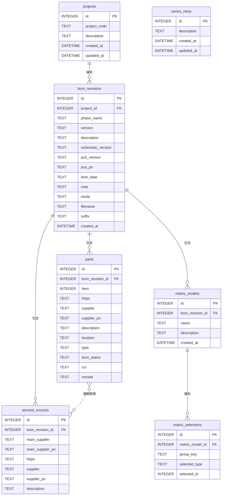

# BOMIX 資料庫結構設計

> 版本：1.1.0 | 最後更新：2026-02-13
>
> 詳細 Schema 定義請參考 `src/main/database/schema.js`

## 儲存策略

- 每個**系列（Series）**存為一個獨立的 **`.bomix`** 檔案（SQLite 格式）
- 使用者可自行選擇儲存位置
- 支援手動備份（直接複製 .bomix 檔案）
- 零件採用**原子化儲存**：每個 location 為一筆獨立紀錄
- 主行程使用 `better-sqlite3` 同步 API 存取 SQLite
- **Matrix BOM** 採用獨立表儲存，不影響 Base BOM 結構

## ER 圖

```
series_meta（單一紀錄）

projects 1──* bom_revisions 1──* parts
                 |                 ↑ (邏輯群組關聯)
                 |          second_sources
                 |
                 └──* matrix_models 1──* matrix_selections
```



---

## 資料表詳細定義

### series_meta — 系列設定與資訊
| 欄位 | 型別 | 約束 | 說明 |
|------|------|------|------|
| id | INTEGER | PK, DEFAULT 1 | 主鍵（固定為 1，僅一筆紀錄） |
| description | TEXT | | 系列描述 |
| created_at | DATETIME | DEFAULT CURRENT_TIMESTAMP | 系列建立時間 |
| updated_at | DATETIME | DEFAULT CURRENT_TIMESTAMP | 最後修改時間 |

> 設計說明：每個 `.bomix` 檔案僅含一筆 `series_meta` 紀錄。
> 使用固定 `id = 1`。未來可擴充欄位用於儲存使用者設定值。

---

### projects — 專案
| 欄位 | 型別 | 約束 | 說明 |
|------|------|------|------|
| id | INTEGER | PK, AUTOINCREMENT | 主鍵 |
| project_code | TEXT | NOT NULL, UNIQUE | 專案代碼（如 TANGLED） |
| description | TEXT | | 專案描述 |
| created_at | DATETIME | DEFAULT CURRENT_TIMESTAMP | 建立時間 |
| updated_at | DATETIME | DEFAULT CURRENT_TIMESTAMP | 更新時間 |

---

### bom_revisions — BOM 版本（合併 Phase + Version）
| 欄位 | 型別 | 約束 | 說明 |
|------|------|------|------|
| id | INTEGER | PK, AUTOINCREMENT | 主鍵 |
| project_id | INTEGER | FK → projects.id, NOT NULL | 所屬專案 |
| phase_name | TEXT | NOT NULL | Phase 名稱（可自訂） |
| version | TEXT | NOT NULL | 版本號（0.1, 0.2...） |
| description | TEXT | | BOM 描述 |
| schematic_version | TEXT | | Schematic 版本 |
| pcb_version | TEXT | | PCB 版本 |
| pca_pn | TEXT | | PCA 料號 |
| bom_date | TEXT | | BOM 日期 (原 date) |
| note | TEXT | | 版本備註 |
| mode | TEXT | DEFAULT 'NPI' | NPI/MP 模式 |
| filename | TEXT | | 原始 Excel 檔名 |
| suffix | TEXT | | 版本後綴 (如 A, B, Test) |
| created_at | DATETIME | DEFAULT CURRENT_TIMESTAMP | 建立時間 |

**唯一約束**：`UNIQUE(project_id, phase_name, version)`

---

### parts — 零件（原子化儲存）
| 欄位 | 型別 | 約束 | 說明 |
|------|------|------|------|
| id | INTEGER | PK, AUTOINCREMENT | 主鍵 |
| bom_revision_id | INTEGER | FK → bom_revisions.id, NOT NULL | 所屬 BOM 版本 |
| item | INTEGER | | 項目編號 |
| hhpn | TEXT | | 公司內部料號 |
| supplier | TEXT | NOT NULL | 供應商名稱 |
| supplier_pn | TEXT | NOT NULL | 供應商料號 |
| description | TEXT | | 零件描述 |
| location | TEXT | NOT NULL | 零件位置（單一位置） |
| type | TEXT | | 製程（SMD/PTH/BOTTOM） |
| bom_status | TEXT | NOT NULL, DEFAULT 'I' | 上件狀態（I/X/P/M） |
| ccl | TEXT | DEFAULT 'N' | 是否為 Critical Part |
| remark | TEXT | | 註記 |

**索引**：
- `INDEX idx_parts_group ON parts(bom_revision_id, supplier, supplier_pn, type)`
- `INDEX idx_parts_location ON parts(bom_revision_id, location)`

---

### second_sources — 替代料
| 欄位 | 型別 | 約束 | 說明 |
|------|------|------|------|
| id | INTEGER | PK, AUTOINCREMENT | 主鍵 |
| bom_revision_id | INTEGER | FK → bom_revisions.id, NOT NULL | 所屬 BOM 版本 |
| main_supplier | TEXT | NOT NULL | 關聯主料的供應商名稱 |
| main_supplier_pn | TEXT | NOT NULL | 關聯主料的供應商料號 |
| hhpn | TEXT | | 替代料公司內部料號 |
| supplier | TEXT | NOT NULL | 替代料供應商名稱 |
| supplier_pn | TEXT | NOT NULL | 替代料供應商料號 |
| description | TEXT | | 替代料零件描述 |

**索引**：
- `INDEX idx_ss_main ON second_sources(bom_revision_id, main_supplier, main_supplier_pn)`

---

### matrix_models — Matrix 專案定義
| 欄位 | 型別 | 約束 | 說明 |
|------|------|------|------|
| id | INTEGER | PK, AUTOINCREMENT | 主鍵 |
| bom_revision_id | INTEGER | FK → bom_revisions.id, NOT NULL | 所屬 BOM 版本 (ON DELETE CASCADE) |
| name | TEXT | NOT NULL | Model 名稱 (如 Model A, SKU_1) |
| description | TEXT | | Model 備註 |
| created_at | DATETIME | DEFAULT CURRENT_TIMESTAMP | 建立時間 |

---

### matrix_selections — Matrix 勾選紀錄
| 欄位 | 型別 | 約束 | 說明 |
|------|------|------|------|
| id | INTEGER | PK, AUTOINCREMENT | 主鍵 |
| matrix_model_id | INTEGER | FK → matrix_models.id, NOT NULL | 所屬 Matrix Model (ON DELETE CASCADE) |
| group_key | TEXT | NOT NULL | 群組識別鍵 (`supplier\|supplier_pn`) |
| selected_type | TEXT | NOT NULL | 'part' 或 'second_source' |
| selected_id | INTEGER | NOT NULL | 對應 `parts.id` 或 `second_sources.id` |

**唯一約束**：`UNIQUE(matrix_model_id, group_key)` - 確保每個 Model 在每個零件群組只能選一個

---

## 常用查詢範例

### 取得 BOM Main Item 聚合視圖
```sql
SELECT
    supplier,
    supplier_pn,
    hhpn,
    description,
    type,
    bom_status,
    ccl,
    GROUP_CONCAT(location) AS locations,
    COUNT(location) AS quantity
FROM parts
WHERE bom_revision_id = ?
GROUP BY supplier, supplier_pn, type
ORDER BY MIN(item);
```

### 查詢某主料的所有替代料
```sql
SELECT ss.*
FROM second_sources ss
WHERE ss.bom_revision_id = ?
  AND ss.main_supplier = ?
  AND ss.main_supplier_pn = ?;
```

### 查詢 Matrix Model 的所有選擇
```sql
SELECT * FROM matrix_selections
WHERE matrix_model_id = ?;
```
