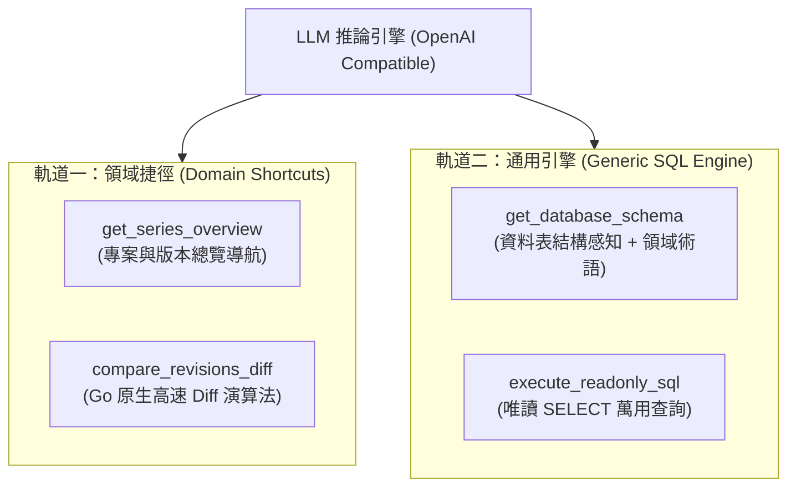
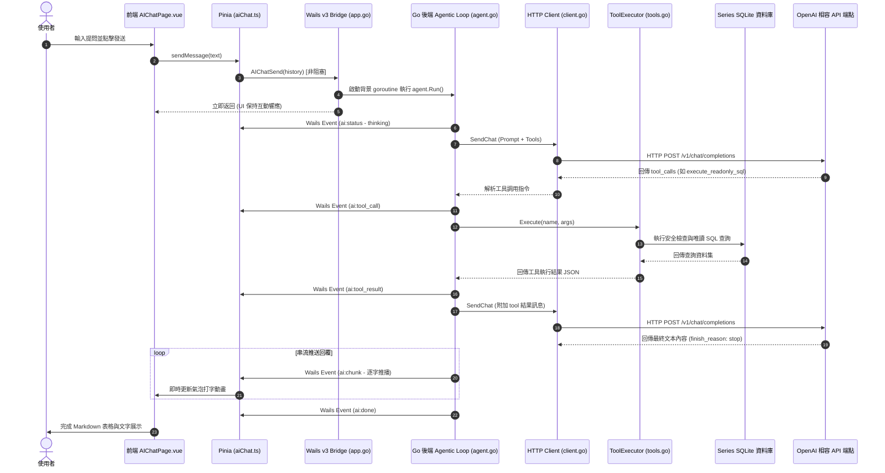

# BOMIX AI 助手規格說明書 (AI Assistant Specification)

> 本文檔為 BOMIX 專案之智慧 AI 對話助手功能規格書，完整記錄系統中基於 OpenAI 標準相容 API 的 LLM 整合架構、雙軌混合 Function Calling 工具設計、SQLite 三重唯讀安全防護機制、英文提示詞邏輯與語言約束結構、Wails 非同步事件串流通訊協議及前端 Markdown 視覺化對話介面規範。

---

## 目錄

1. [核心設計理念與架構概觀](#1-核心設計理念與架構概觀)
2. [系統架構圖與資料流](#2-系統架構圖與資料流)
3. [雙軌混合 Function Tool 規格](#3-雙軌混合-function-tool-規格)
4. [三重唯讀安全防護機制](#4-三重唯讀安全防護機制)
5. [系統提示詞架構 (System Prompt Architecture)](#5-系統提示詞架構-system-prompt-architecture)
6. [Wails 前後端事件串流通訊協議](#6-wails-前後端事件串流通訊協議)
7. [前端對話介面與視覺化規範](#7-前端對話介面與視覺化規範)
8. [設定管理與連線測試](#8-設定管理與連線測試)
9. [未來擴充指引](#9-未來擴充指引)

---

## 1. 核心設計理念與架構概觀

BOMIX AI 助手旨在讓硬體工程師、專案經理與供應鏈分析師能夠透過自然語言對話，快速挖掘與分析當前開啟的系列 SQLite 資料庫。

### 1.1 設計挑戰

1. **資料範圍嚴格侷限**：AI 的作用範圍必須且僅能限制在當前已開啟的 Series 資料庫中，不可存取系統外部檔案或修改任何業務數據。
2. **絕對資料安全（唯讀防護）**：防止 LLM 幻覺生成任何破壞性的 `INSERT`、`UPDATE`、`DELETE` 或 `DROP` 語句。
3. **靈活性與深度演算法兼備**：既要支援已知的高複雜度業務操作（例如跨版本 BOM 零件差異比對），又要具備足夠的泛化能力回答未預期問題（長尾問題）。
4. **流暢的使用者體驗**：長時間的查詢與推論不可凍結桌面 UI 主執行緒，且 LLM 回應需具備打字機串流效果、工具執行卡片狀態展示與安全 Markdown / HTML 渲染。

### 1.2 雙軌混合架構 (Hybrid Architecture)

為兼顧「**高複雜度領域計算**」與「**無限通用靈活性**」，本系統採用雙軌架構：



- **軌道一（領域捷徑）**：
  針對固定且高運算成本的業務場景（如比對兩份 BOM 的用量、位置、主替料差異），直接呼叫 Go 後端原生演算法，避免 LLM 自行撰寫包含多層 JOIN 的複雜 SQL，保證 100% 精準與毫秒級效能。
- **軌道二（通用引擎）**：
  LLM 透過 `get_database_schema` 取得完整表結構與術語對照後，使用 `execute_readonly_sql` 自由生成單純的唯讀 `SELECT` 查詢，涵蓋多維度統計、物料跨專案搜尋、供應商料號交叉查詢等所有長尾未知場景。

---

## 2. 系統架構圖與資料流



---

## 3. 雙軌混合 Function Tool 規格

所有 Function Tool 定義均採用英文描述 (`description`)，以最大化 LLM 的理解力與呼叫準確性。

### 3.1 `get_database_schema` (結構感知)

```json
{
  "type": "function",
  "function": {
    "name": "get_database_schema",
    "description": "Retrieve the complete database schema (table definitions, columns, foreign keys) of the currently opened BOM series SQLite database, along with domain terminology mappings. The LLM must call this tool before generating SQL queries to inspect the schema.",
    "parameters": {
      "type": "object",
      "properties": {}
    }
  }
}
```

- **後端實作**：
  - 查詢 `sqlite_master` 取得排除內部系統表以外的所有資料表。
  - 執行 `PRAGMA table_info(...)` 與 `PRAGMA foreign_key_list(...)` 取得欄位型態、主鍵與外鍵關聯。
  - 附帶硬編碼的領域術語字典（Glossary），包含 `Phase`、`Location/RefDes`、`Role (M/S)`、`BomStatus (I/X/P/M)`、`Type (SMD/PTH)`、`MatrixModel` 等說明。

### 3.2 `execute_readonly_sql` (通用唯讀引擎)

```json
{
  "type": "function",
  "function": {
    "name": "execute_readonly_sql",
    "description": "Execute a read-only SELECT SQL query on the active series SQLite database. Only SELECT and WITH statements are allowed. Any data modification statements are strictly forbidden. Maximum 100 rows returned. Ideal for aggregations, cross-project lookups, and arbitrary filters.",
    "parameters": {
      "type": "object",
      "required": ["sql"],
      "properties": {
        "sql": {
          "type": "string",
          "description": "Read-only SELECT query (supports JOINs, GROUP BY, ORDER BY, subqueries, etc.)"
        },
        "explanation": {
          "type": "string",
          "description": "Brief explanation of what this query aims to find"
        }
      }
    }
  }
}
```

- **回傳結構 (`QueryResult`)**：
  ```json
  {
    "columns": ["code", "count"],
    "rows": [{"code": "Taris", "count": 2840}],
    "row_count": 1,
    "truncated": false,
    "message": ""
  }
  ```

### 3.3 `get_series_overview` (導航起點)

```json
{
  "type": "function",
  "function": {
    "name": "get_series_overview",
    "description": "Get an overview of projects and their BOM revisions (Phase, Version, dates, mode, models count) in the current series. Used to verify project names, check available revisions, and obtain revision IDs for detailed queries.",
    "parameters": {
      "type": "object",
      "properties": {
        "project_code": {
          "type": "string",
          "description": "Optional project code to filter by. If omitted, returns all projects in the series."
        }
      }
    }
  }
}
```

### 3.4 `compare_revisions_diff` (領域高速比對)

```json
{
  "type": "function",
  "function": {
    "name": "compare_revisions_diff",
    "description": "Compare differences between two BOM revisions (within the same project or across projects). Uses a native Go diff algorithm to categorize added, removed, and modified parts (quantity changes, location changes, 2nd source alterations).",
    "parameters": {
      "type": "object",
      "required": ["base_revision_id", "target_revision_id"],
      "properties": {
        "base_revision_id": {
          "type": "integer",
          "description": "Revision ID of the baseline (older) revision"
        },
        "target_revision_id": {
          "type": "integer",
          "description": "Revision ID of the target (newer) revision"
        },
        "change_type_filter": {
          "type": "string",
          "enum": ["ALL", "ADDED", "REMOVED", "MODIFIED"],
          "description": "Optional filter by change type. Defaults to ALL."
        },
        "limit": {
          "type": "integer",
          "description": "Optional max number of detail items returned (default 50)"
        }
      }
    }
  }
}
```

- **後端實作**：
  - 呼叫 `view.NewService(te.db).Query()` 分別載入基準版本與比對版本的聚合資料。
  - 以 `(MainSupplier, MainSupplierPN)` 為鍵進行 Set 差集與交集運算。
  - 自動比對：用量差額 (`QtyDelta`)、打件位置分配 (`Locations`)、上件狀態 (`BOMStatus`)、替代料清單變動。
  - 回傳 summary 統計與受 limit 限制的明細列表。

---

## 4. 三重唯讀安全防護機制

為確保本機 SQLite 資料庫永不被 AI 惡意篡改或誤寫入，系統實施三重保護機制：

| 防護層級 | 實施機制 | 說明 |
|:---|:---|:---|
| **L1 應用層（語法白名單）** | `ValidateReadOnlySQL()` | 1. 移除單行/多行註解。<br/>2. 嚴格禁止分號串接多條語句（避免 `; DROP TABLE ...` 注入）。<br/>3. 開頭必須為 `SELECT` 或 `WITH`。<br/>4. 全詞匹配禁止黑名單關鍵字：`INSERT`、`UPDATE`、`DELETE`、`DROP`、`ALTER`、`CREATE`、`ATTACH`、`DETACH`、`REPLACE`、`TRUNCATE`、`TRANSACTION`、`COMMIT`、`ROLLBACK`、`VACUUM`、`REINDEX`、`PRAGMA` 等。 |
| **L2 自動限流保護** | 自動注入 `LIMIT 100` | 若傳入的 SQL 未包含 `LIMIT` 子句，程式於尾部強制附加 `LIMIT 100`；若查詢結果達到上限，自動標記 `truncated: true`。 |
| **L3 執行逾時保護** | `context.WithTimeout` | 查詢語句設定 10 秒執行逾時，防止笛卡兒積（Cartesian product）或死迴圈查詢占用本機資源。 |

---

## 5. 系統提示詞架構 (System Prompt Architecture)

採用「**英文推理邏輯 + 結尾語言約束**」的結構設計。

### 5.1 英文提示詞主體 (`SystemPromptBase`)

```text
You are BOMIX Assistant, an expert AI analyst specializing in electronic hardware Bill of Materials (BOM) management.

## Role & Mission
You help hardware engineers, project managers, and supply chain analysts explore, query, and compare BOM data from the currently active Series database.

## Available Tools
1. get_database_schema:
   Inspect tables, columns, foreign keys, and domain glossary. You MUST inspect the schema before crafting custom SQL queries if table details are unknown.
2. execute_readonly_sql:
   Execute read-only SELECT SQL queries for custom aggregations, searches, filtering, or cross-project lookups.
3. get_series_overview:
   Retrieve an overview of projects and their BOM revisions (Phase, Version, dates, models count). Use this to verify project codes and find Revision IDs.
4. compare_revisions_diff:
   Run a specialized native Go algorithm to compute additions, removals, and modifications between two revisions (e.g. Qty changes, location changes, 2nd source alterations).

## Execution Guidelines
- Always verify project codes and revision IDs with get_series_overview before querying revisions or doing diff comparisons.
- For revision comparison or change tracking, prefer compare_revisions_diff rather than writing complex SQL queries.
- Format tabular data using Markdown tables.
- Use clear bullet points and bold highlights for important takeaways.
- When generating SQL queries for execute_readonly_sql:
  - Only write read-only SELECT statements.
  - Do NOT modify data or write DDL commands.
  - The query result will be limited to at most 100 rows.
  - Explain the query intent briefly in the explanation argument.
- Never hallucinate data. If data is not found or inconclusive, clearly inform the user.
```

### 5.2 動態語言約束注入 (`GetSystemPrompt(language)`)

使用者可在設定頁面設定回應語言，後端動態附加對應指令：

- **繁體中文 (`zh-TW`, 預設)**：
  ```text
  ## Language Constraint
  Always respond in Traditional Chinese (繁體中文).
  ```
- **簡體中文 (`zh-CN`)**：
  ```text
  ## Language Constraint
  Always respond in Simplified Chinese (简体中文).
  ```
- **英文 (`en`)**：
  ```text
  ## Language Constraint
  Always respond in English.
  ```

---

## 6. Wails 前後端事件串流通訊協議

後端透過 `a.EmitEvent(event, data)` 推送事件，前端監聽並即時響應：

| 事件名稱 | Payload 結構 | 說明 |
|:---|:---|:---|
| `ai:status` | `{ status: string, message: string }` | 助手狀態通知（"thinking"、"calling_tool"、"streaming"、"idle"） |
| `ai:tool_call` | `{ id: string, name: string, arguments: string, explanation?: string }` | LLM 請求執行工具，觸發 UI 渲染工具卡片 |
| `ai:tool_result` | `{ id: string, name: string, result: string, success: boolean }` | 工具執行完成，更新卡片狀態為成功或失敗 |
| `ai:chunk` | `{ chunk: string }` | 逐字推播回覆文字，驅動打字機平滑動畫 |
| `ai:done` | `{ full_response: string }` | 整個 Agentic 對話回合結束 |
| `ai:error` | `{ error: string }` | 執行過程發生錯誤通知 |

---

## 7. 前端對話介面與視覺化規範

### 7.1 元件層次架構

```
AIChatPage.vue (主頁面)
├── 頁首資訊工具列 (目前系列名稱、停止按鈕、清空按鈕)
├── 捲動訊息容器
│   ├── 歡迎畫面 (PromptChip.vue * 4 快捷提問)
│   └── 訊息清單 (MessageBubble.vue)
│       ├── 使用者氣泡 (靠右、Primary 漸層)
│       └── 助手氣泡 (靠左、Markdown 容器)
│           ├── ToolCallCard.vue (可摺疊 JSON 參數與結果)
│           └── Markdown 渲染結果 (marked + DOMPurify + highlight.js)
└── 底部自適應輸入列 (Textarea、發送按鈕、即時狀態列)
```

### 7.2 安全 Markdown 渲染管線

```
原始 Markdown 字串
  ↓
marked.parse() 轉為 HTML 結構 (支援 GFM Table、List、Blockquote)
  ↓
highlight.js 注入程式碼區塊語法高亮 (SQL, JSON, etc.)
  ↓
DOMPurify.sanitize() 徹底清除惡意 XSS 標籤
  ↓
v-html 安全注入 Vue DOM
```

---

## 8. 設定管理與連線測試

### 8.1 設定資料結構 (`AIConfig` / `AISettings`)

| 欄位 | 型態 | 預設值 | 說明 |
|:---|:---|:---|:---|
| `enabled` | `bool` | `false` | 是否啟用 AI 功能 |
| `base_url` | `string` | `https://api.openai.com/v1` | OpenAI 相容端點網址 |
| `api_key` | `string` | `""` | API 金鑰（傳遞至前端時遮罩處理） |
| `model` | `string` | `gpt-4o-mini` | 呼叫的模型識別名稱 |
| `temperature` | `float64` | `0.1` | 取樣溫度 (0.0 - 2.0) |
| `max_tokens` | `int` | `4096` | 單次回應 Token 上限 |
| `timeout` | `int` | `60` | HTTP 請求超時秒數 (5 - 300) |
| `language` | `string` | `zh-TW` | 回應語言偏好 (`zh-TW` \| `zh-CN` \| `en`) |

### 8.2 設定頁面功能

- 設定項目支援**即時自動儲存 (Debounced Auto-save)**。
- 提供「**測試連線 (Test Connection)**」功能：點擊後自動保存當前設定並發送輕量測試請求至後端驗證，並在介面上顯示成功或失敗診斷訊息。

---

## 9. 未來擴充指引

1. **對話紀錄本機持久化**：目前對話歷史保存於 Pinia Store 記憶體中，未來可擴充在系列 SQLite 資料庫中新增 `ai_conversations` 與 `ai_messages` 資料表，支援歷史對話留存與查詢。
2. **多 Model 勾選比較工具**：可新增 `compare_matrix_models` 工具，比對同一 BOM 版本下不同打件 Model 之間的用料選取差異。
3. **客製化 System Prompt 覆寫**：允許進階使用者在設定頁面填寫個人專屬的額外 Prompt 指令。
