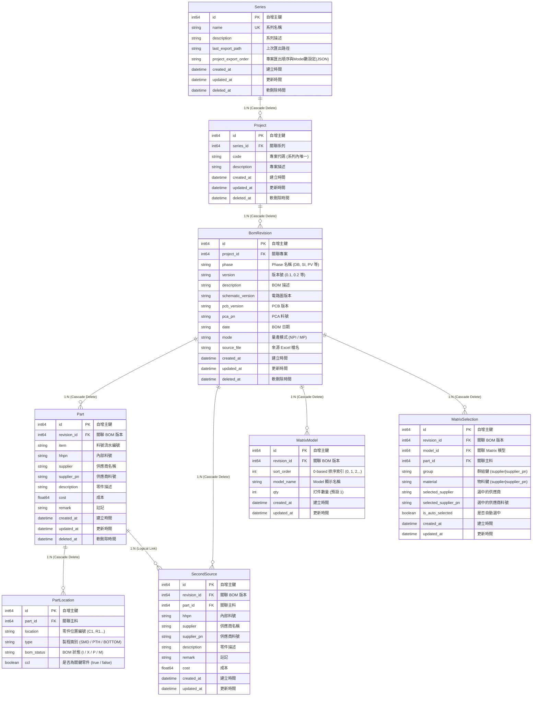

# BOMIX 資料庫規格說明書 (Database Specification)

> 本文檔為 BOMIX 專案之完整資料庫存取架構與資料模型規格書，完整記錄當前系統中 SQLite 儲存層、Location 原子化架構、EBOM/BigMatrix 兩階段匯入機制、View 記憶體聚合查詢系統與相關 API 規格。

---

## 目錄

1. [核心設計原則與架構概觀](#1-核心設計原則與架構概觀)
2. [實體關聯圖 (ER Diagram)](#2-實體關聯圖-er-diagram)
3. [資料表結構定義 (Schema Details)](#3-資料表結構定義-schema-details)
4. [連線管理與並發寫入架構](#4-連線管理與並發寫入架構)
5. [Excel 匯入資料存取流程 (Import Architecture)](#5-excel-匯入資料存取流程-import-architecture)
6. [View 系統與記憶體聚合查詢 (Query & Aggregation)](#6-view-系統與記憶體聚合查詢-query--aggregation)
7. [後端資料庫層 API 規格清單 (`backend/db/`)](#7-後端資料庫層-api-規格清單-backenddb)

---

## 1. 核心設計原則與架構概觀

BOMIX 採用以 **Location 原子化** 與 **Part 主料表純化** 為核心的關聯式資料庫設計，結合 Go 記憶體聚合技術，在 SQLite 本地儲存環境下達成最佳的資料一致性、空間節省率與極致查詢效能。

### 1.1 核心設計原則

| 原則 | 說明 | 效益 |
|------|------|------|
| **Location 原子化** | 每個零件位置編號（如 `C1`、`R12`）作為一筆獨立紀錄儲存在 `part_locations` 表中，不以逗號分隔字串儲存於物料表。 | 支援針對單一 Location 的狀態精確覆寫、CCL 判定與高效過濾。 |
| **Part 純化物料資訊** | `parts` 表僅存放物料固有屬性（`supplier`, `supplier_pn`, `description`, `cost`, `remark`, `hhpn`, `item`），移除 `location`, `quantity`, `bom_status`, `ccl`。 | 符合第三正規化（3NF），避免物料屬性重複儲存，節省 60~70% 儲存空間。 |
| **屬性與狀態跟隨 Location** | `bom_status`（上件狀態：I/X/P/M）、`ccl`（關鍵零件：bool）與 `type`（製程面別：SMD/PTH/BOTTOM）全部定義於 `part_locations` 表。 | 精確反映硬體設計實際情況：同一料號在不同位置可能具備不同製程面別或上件狀態。 |
| **物料去重 (Deduplication)** | 同一 Revision 內相同 `(supplier, supplier_pn)` 的物料在 `parts` 表中僅保留單一實體。 | 簡化主料識別，強化資料一致性。 |
| **批量載入 + 記憶體聚合** | 查詢時避免 N+1 查詢，先以 `IN ?` 批量載入原始資料，再於 Go 記憶體以 $O(n)$ 進行位置拼接與數量彙總。 | 支援單 BOM 載入 < 10ms、8 BOM 聯集 < 20ms、視圖切換 < 5ms。 |
| **Single Writer 安全寫入** | SQLite 啟用 WAL 模式，配合 Go Channel 佇列與 `MaxOpenConns=1` 序列化寫入。 | 保證高並發讀取下，資料庫寫入零鎖死（`database is locked`）。 |

---

## 2. 實體關聯圖 (ER Diagram)



---

## 3. 資料表結構定義 (Schema Details)

### 3.1 Series (系列元資料表)
儲存產品系列層級之總體資訊與匯出偏好。
* **Table Name**: `series`

| 欄位名稱 | 型別 (Go / SQLite) | 約束條件 | 說明 |
|---|---|---|---|
| `id` | `int64` / `INTEGER` | PRIMARY KEY | 自增主鍵 |
| `name` | `string` / `TEXT` | NOT NULL, UNIQUE (`idx_series_name`) | 系列名稱 |
| `description` | `string` / `TEXT` | | 描述說明 |
| `last_export_path` | `string` / `TEXT` | | 上次匯出目標路徑 |
| `project_export_order` | `string` / `TEXT` | | JSON 格式，儲存專案匯出排序與 Model 數量設定 |
| `created_at` | `time.Time` / `DATETIME` | | 建立時間 |
| `updated_at` | `time.Time` / `DATETIME` | | 更新時間 |
| `deleted_at` | `gorm.DeletedAt` / `DATETIME` | INDEX (`idx_series_deleted_at`) | GORM 軟刪除時間戳 |

### 3.2 Projects (專案表)
儲存系列下屬之各個獨立專案（Product Code）。
* **Table Name**: `projects`

| 欄位名稱 | 型別 (Go / SQLite) | 約束條件 | 說明 |
|---|---|---|---|
| `id` | `int64` / `INTEGER` | PRIMARY KEY | 自增主鍵 |
| `series_id` | `int64` / `INTEGER` | NOT NULL, INDEX (`idx_project_series`) | 關聯所屬 `series.id` |
| `code` | `string` / `TEXT` | NOT NULL, INDEX (`idx_project_code`) | 專案代碼（系列內唯一） |
| `description` | `string` / `TEXT` | | 專案描述說明 |
| `created_at` | `time.Time` / `DATETIME` | | 建立時間 |
| `updated_at` | `time.Time` / `DATETIME` | | 更新時間 |
| `deleted_at` | `gorm.DeletedAt` / `DATETIME` | INDEX (`idx_projects_deleted_at`) | GORM 軟刪除時間戳 |

### 3.3 BomRevisions (BOM 版本表)
儲存每一次匯入或建立的 BOM 版本元資料。
* **Table Name**: `bom_revisions`

| 欄位名稱 | 型別 (Go / SQLite) | 約束條件 | 說明 |
|---|---|---|---|
| `id` | `int64` / `INTEGER` | PRIMARY KEY | 自增主鍵 |
| `project_id` | `int64` / `INTEGER` | NOT NULL, 複合唯一索引 | 關聯所屬 `projects.id` |
| `phase` | `string` / `TEXT` | NOT NULL, 複合唯一索引 | Phase 名稱（如 DB, SI, PV 等） |
| `version` | `string` / `TEXT` | NOT NULL, 複合唯一索引 | 版本號（如 0.1, 0.2 等） |
| `description` | `string` / `TEXT` | | BOM 描述 |
| `schematic_version`| `string` / `TEXT` | | 電路圖版本 |
| `pcb_version` | `string` / `TEXT` | | PCB 版本 |
| `pca_pn` | `string` / `TEXT` | | PCA 料號 |
| `date` | `string` / `TEXT` | | BOM 日期字串 |
| `mode` | `string` / `TEXT` | DEFAULT `'NPI'` | 量產模式：`NPI` 或 `MP` |
| `source_file` | `string` / `TEXT` | | 來源 Excel 原始檔名 |
| `created_at` | `time.Time` / `DATETIME` | | 建立時間 |
| `updated_at` | `time.Time` / `DATETIME` | | 更新時間 |
| `deleted_at` | `gorm.DeletedAt` / `DATETIME` | INDEX (`idx_bom_revisions_deleted_at`) | GORM 軟刪除時間戳 |

* **複合唯一約束**: `idx_revision_project_phase_version` 涵蓋 `(project_id, phase, version)`，確保同一專案內 Phase 與 Version 組合唯一。

### 3.4 Parts (主料表 - 純化物料資訊)
儲存去重後的主料物料基本資訊，不包含任何位置與數量資訊。
* **Table Name**: `parts`

| 欄位名稱 | 型別 (Go / SQLite) | 約束條件 | 說明 |
|---|---|---|---|
| `id` | `int64` / `INTEGER` | PRIMARY KEY | 自增主鍵 |
| `revision_id` | `int64` / `INTEGER` | NOT NULL, 複合索引 | 關聯所屬 `bom_revisions.id` |
| `item` | `string` / `TEXT` | | 原始 Excel 流水號 |
| `hhpn` | `string` / `TEXT` | | 內部料號 |
| `supplier` | `string` / `TEXT` | NOT NULL, 複合索引 | 供應商名稱（廠牌） |
| `supplier_pn` | `string` / `TEXT` | NOT NULL, 複合索引 | 供應商料號 |
| `description` | `string` / `TEXT` | | 零件描述 |
| `cost` | `float64` / `REAL` | | 成本 |
| `remark` | `string` / `TEXT` | | 註記 |
| `created_at` | `time.Time` / `DATETIME` | | 建立時間 |
| `updated_at` | `time.Time` / `DATETIME` | | 更新時間 |
| `deleted_at` | `gorm.DeletedAt` / `DATETIME` | INDEX (`idx_parts_deleted_at`) | GORM 軟刪除時間戳 |

* **複合索引**: `idx_part_revision_supplier_pn` 涵蓋 `(revision_id, supplier, supplier_pn)`，加速物料群組查詢與去重比對。

### 3.5 PartLocations (Location 原子化獨立表)
每個零件位置編號一筆紀錄，記錄該位置專屬的製程類型、上件狀態與 CCL 標記。
* **Table Name**: `part_locations`

| 欄位名稱 | 型別 (Go / SQLite) | 約束條件 | 說明 |
|---|---|---|---|
| `id` | `int64` / `INTEGER` | PRIMARY KEY | 自增主鍵 |
| `part_id` | `int64` / `INTEGER` | NOT NULL, INDEX (`idx_part_location_part`) | 關聯所屬主料 `parts.id` |
| `location` | `string` / `TEXT` | NOT NULL, INDEX (`idx_part_location_name`) | 零件位置編號（如 `C1`, `R105`） |
| `type` | `string` / `TEXT` | INDEX (`idx_part_location_type`) | 製程面別：`SMD`, `PTH`, `BOTTOM` |
| `bom_status` | `string` / `TEXT` | DEFAULT `'I'`, INDEX (`idx_part_location_status`) | 上件狀態：`I` (Install), `X` (NI), `P` (Proto), `M` (MP) |
| `ccl` | `bool` / `BOOLEAN`| DEFAULT `false`, INDEX (`idx_part_location_ccl`) | 關鍵零件標記：`true` (是), `false` (否) |

* **複合索引**: `idx_part_loc_status_ccl` 涵蓋 `(bom_status, ccl)`，用於高速過濾 CCL 視圖與 NPI/MP 狀態檢索。

### 3.6 SecondSources (替代料表)
儲存關聯於主料的二階替代料（2nd Source）。
* **Table Name**: `second_sources`

| 欄位名稱 | 型別 (Go / SQLite) | 約束條件 | 說明 |
|---|---|---|---|
| `id` | `int64` / `INTEGER` | PRIMARY KEY | 自增主鍵 |
| `revision_id` | `int64` / `INTEGER` | NOT NULL, INDEX (`idx_second_source_revision`) | 關聯所屬 `bom_revisions.id` |
| `part_id` | `int64` / `INTEGER` | NOT NULL, INDEX (`idx_second_sources_part_id`) | 關聯所屬主料 `parts.id` |
| `hhpn` | `string` / `TEXT` | | 內部料號 |
| `supplier` | `string` / `TEXT` | NOT NULL | 供應商名稱（廠牌） |
| `supplier_pn` | `string` / `TEXT` | NOT NULL | 供應商料號 |
| `description` | `string` / `TEXT` | | 零件描述 |
| `remark` | `string` / `TEXT` | | 註記 |
| `cost` | `float64` / `REAL` | | 成本 |
| `created_at` | `time.Time` / `DATETIME` | | 建立時間 |
| `updated_at` | `time.Time` / `DATETIME` | | 更新時間 |

### 3.7 MatrixModels (Matrix 模型表)
儲存 Matrix 勾選矩陣中的 Model 配置資訊。
* **Table Name**: `matrix_models`

| 欄位名稱 | 型別 (Go / SQLite) | 約束條件 | 說明 |
|---|---|---|---|
| `id` | `int64` / `INTEGER` | PRIMARY KEY | 自增主鍵 |
| `revision_id` | `int64` / `INTEGER` | NOT NULL, 複合唯一索引 | 關聯所屬 `bom_revisions.id` |
| `sort_order` | `int` / `INTEGER` | NOT NULL, 複合唯一索引 | 0-based 排序索引（0, 1, 2...） |
| `model_name` | `string` / `TEXT` | | Model 顯示名稱（選填，如 A, B, C...） |
| `qty` | `int` / `INTEGER` | NOT NULL, DEFAULT `1` | 打件數量 |
| `created_at` | `time.Time` / `DATETIME` | | 建立時間 |
| `updated_at` | `time.Time` / `DATETIME` | | 更新時間 |

* **複合唯一約束**: `idx_matrix_model_revision_order` 涵蓋 `(revision_id, sort_order)`，保證同一 Revision 內 Model 順序唯一且可精確排序。

### 3.8 MatrixSelections (Matrix 勾選表)
記錄特定 Model 在特定物料群組中選中了哪一顆料（主料或某個替代料）。
* **Table Name**: `matrix_selections`

| 欄位名稱 | 型別 (Go / SQLite) | 約束條件 | 說明 |
|---|---|---|---|
| `id` | `int64` / `INTEGER` | PRIMARY KEY | 自增主鍵 |
| `revision_id` | `int64` / `INTEGER` | NOT NULL, INDEX (`idx_matrix_selections_revision_id`) | 關聯所屬 `bom_revisions.id` |
| `model_id` | `int64` / `INTEGER` | NOT NULL, 複合唯一索引 | 關聯所屬 `matrix_models.id` |
| `part_id` | `int64` / `INTEGER` | NOT NULL, INDEX (`idx_matrix_selections_part_id`) | 關聯所屬主料 `parts.id` |
| `group` | `string` / `TEXT` | NOT NULL, 複合唯一索引 | 群組識別鍵 (`main_supplier|main_supplier_pn`) |
| `material` | `string` / `TEXT` | NOT NULL, 複合唯一索引 | 被選中物料鍵 (`supplier|supplier_pn`) |
| `selected_supplier` | `string` / `TEXT` | | 選中的供應商名稱 |
| `selected_supplier_pn`| `string` / `TEXT`| | 選中的供應商料號 |
| `is_auto_selected` | `bool` / `BOOLEAN`| DEFAULT `false` | 是否由系統自動預設選中 |
| `created_at` | `time.Time` / `DATETIME` | | 建立時間 |
| `updated_at` | `time.Time` / `DATETIME` | | 更新時間 |

* **複合唯一約束**: `idx_matrix_selection_model_group_material` 涵蓋 `(model_id, group, material)`，防止同一個 Model 對同一群組重複記錄相同物料。

---

## 4. 連線管理與並發寫入架構

實作於 [`backend/db/connection.go`](file:///z:/Programming/BOMIX/bomix-app/backend/db/connection.go)。

### 4.1 SQLite 驅動與 Pragma 調優
BOMIX 採用純 Go 實現的 `github.com/glebarez/sqlite`，在 Windows 環境下完全不需要 CGO 編譯依賴：
1. **WAL 模式**: 執行 `PRAGMA journal_mode=WAL;`，支援讀寫並發，讀取操作不阻塞寫入，寫入操作不阻塞讀取。
2. **Synchronous 調優**: 執行 `PRAGMA synchronous=NORMAL;`，降低磁碟 I/O 等待，提升批次寫入吞吐量。
3. **外鍵級聯刪除**: 執行 `PRAGMA foreign_keys=ON;`，啟用外鍵約束，確保當刪除 Revision 或 Part 時，關聯的 `part_locations`、`second_sources`、`matrix_selections` 能被 SQLite 核心自動 CASCADE 級聯清除。

### 4.2 Single Writer Pattern (單一寫入器模式)
為了避免 SQLite 在高並發背景任務寫入時發生鎖死衝突，系統實作了序列化寫入架構：
* `sqlDB.SetMaxOpenConns(1)` / `sqlDB.SetMaxIdleConns(1)`
* 內部維護 `writeQueue chan WriteTask`（緩衝容量 50）與背景單一 Goroutine (`StartDatabaseWriter`)，所有批次寫入均透過事務有序執行。

---

## 5. Excel 匯入資料存取流程 (Import Architecture)

實作於 [`backend/excel/reader_ebom.go`](file:///z:/Programming/BOMIX/bomix-app/backend/excel/reader_ebom.go) 與 [`backend/excel/reader_bigmatrix.go`](file:///z:/Programming/BOMIX/bomix-app/backend/excel/reader_bigmatrix.go)。

### 5.1 EBOM 兩階段匯入架構

```
Excel 檔案輸入 (SMD, PTH, BOTTOM, NI, PROTO, MP, CCL)
                       │
                       ▼
┌─────────────────────────────────────────────────────────────┐
│ Phase 1: 主料去重建置與 Location 原子化                        │
│ 1. 讀取 SMD, PTH, BOTTOM:                                    │
│    - 依 (supplier, supplier_pn) 去重建置 Part                │
│    - 拆解 Location 字串，建立 PartLocation (bom_status='I')   │
│    - 解析 2nd Source 並關聯 Part 指標                         │
│ 2. 讀取 NI (不上件):                                         │
│    - 依 (supplier, supplier_pn) 檢查/建置 Part                │
│    - 拆解 Location 字串，建立 PartLocation (bom_status='X')   │
└─────────────────────────────────────────────────────────────┘
                       │
                       ▼
┌─────────────────────────────────────────────────────────────┐
│ 資料庫批次寫入 (Transaction)                                 │
│ 1. 刪除該 Revision 舊資料 (CASCADE 自動清除 Locations)        │
│ 2. tx.CreateInBatches(Parts, 500) (取得 GORM 回填 ID)        │
│ 3. 回填 PartID 至 PartLocations 並批次寫入                    │
│ 4. 回填 PartID 至 SecondSources 並批次寫入                   │
└─────────────────────────────────────────────────────────────┘
                       │
                       ▼
┌─────────────────────────────────────────────────────────────┐
│ Phase 2: 狀態屬性覆寫與 Mode 自動判斷 (不新增物料)              │
│ 1. 讀取 PROTO Sheet: 批次 UPDATE 匹配 Location 之 bom_status='P'│
│ 2. 讀取 MP Sheet:    批次 UPDATE 匹配 Location 之 bom_status='M'│
│ 3. 讀取 CCL Sheet:   批次 UPDATE 匹配 Location 之 ccl=true     │
│ 4. determineMode(): 比對 Phase 1 與 PROTO/MP 位置交集           │
│    → 更新 BomRevision.Mode ('NPI' 或 'MP')                   │
└─────────────────────────────────────────────────────────────┘
                       │
                       ▼
┌─────────────────────────────────────────────────────────────┐
│ 後續作業: Merge 演算法 + 上一版 Matrix Selection 自動遷移       │
└─────────────────────────────────────────────────────────────┘
```

### 5.2 Mode (NPI / MP) 自動判斷邏輯
由 `determineMode` 函數執行：
1. 若 PROTO 工作表中的任一 Location 存在於 Phase 1（主製程）已建置的位置集合中 $\rightarrow$ 判定為 **`NPI`**。
2. 若 MP 工作表中的任一 Location 存在於 Phase 1 已建置的位置集合中 $\rightarrow$ 判定為 **`MP`**。
3. 預設值為 **`NPI`**。

### 5.3 BigMatrix 匯入與 Model 對齊
* 水平掃描 Row 2 (Project Code)、Row 3 (Phase-Version)、Row 4 (Model Name)、Row 5 (Qty)。
* 以 **`SortOrder` (0-based 順序索引)** 建立 `MatrixModel`，不受 Model 名稱變更影響。
* 掃描底下物料勾選記號（`V` / `v`），將選中的物料寫入 `MatrixSelection`。

---

## 6. View 系統與記憶體聚合查詢 (Query & Aggregation)

實作於 [`backend/view/service.go`](file:///z:/Programming/BOMIX/bomix-app/backend/view/service.go)、[`backend/view/types.go`](file:///z:/Programming/BOMIX/bomix-app/backend/view/types.go) 與 [`backend/view/filter.go`](file:///z:/Programming/BOMIX/bomix-app/backend/view/filter.go)。

### 6.1 View 系統無狀態架構 (Stateless Service)
`view.Service` 採完全無狀態設計，多個 Goroutine 可同時發起不同的 `ViewQuery`，互不干擾。

```go
type ViewQuery struct {
    RevisionIDs  []int64 // 目標 BOM Revision ID 清單 (1個=單一視圖, 多個=多BOM聯集)
    ViewType     string  // 視圖類型：ALL, SMD, PTH, BOTTOM, NI, PROTO, MP, CCL
    ModeOverride string  // 選填：覆寫 BOM 模式 (NPI 或 MP)
}
```

### 6.2 零 N+1 批量查詢 (`loadRawData`)
透過 6 次 `IN ?` 批量查詢一次性獲取全部所需資料：
1. `BomRevisions` (含關聯 `Projects`)
2. `Parts` (`WHERE revision_id IN ?`)
3. `PartLocations` (`WHERE part_id IN ?`)
4. `SecondSources` (`WHERE revision_id IN ?`)
5. `MatrixModels` (`WHERE revision_id IN ?`)
6. `MatrixSelections` (`WHERE revision_id IN ?`)

### 6.3 記憶體多 BOM 聯集合併 (`mergeRevisions`)
1. **主料聯集**：以 `(supplier, supplier_pn)` 為識別鍵建立群組。
2. **Location 聚合**：收集所有關聯的 `PartLocation`，在記憶體中進行去重、字母排序並以逗號串接（`locations`），計算數量 `qty = len(locations)`。
3. **來源歸屬 (`SourceRevisionIDs`)**：記錄此物料群組在哪些 Revision 中具備有效上件（`bom_status != 'X'`），供前端標記與 BigMatrix 匯出填入灰色底色。
4. **替代料聯集**：以 `(supplier, supplier_pn)` 去重彙整所有 Revision 的替代料，並記錄各替代料在各 Model 的勾選狀態。

### 6.4 8 種視圖過濾規則 (View Filters)

| 視圖代碼 | 視圖名稱 | 過濾條件 |
|---|---|---|
| **`ALL`** | 全部視圖 | `bom_status != 'X'`（排除不上件） |
| **`SMD`** | 正面 SMD 視圖 | `type == 'SMD'` 且 `bom_status != 'X'` |
| **`PTH`** | 通孔 PTH 視圖 | `type == 'PTH'` 且 `bom_status != 'X'` |
| **`BOTTOM`** | 背面 BOTTOM 視圖 | `type == 'BOTTOM'` 且 `bom_status != 'X'` |
| **`NI`** | 不上件視圖 | `bom_status == 'X'` |
| **`PROTO`** | Proto 狀態視圖 | `bom_status == 'P'` |
| **`MP`** | 量產 MP 狀態視圖 | `bom_status == 'M'` |
| **`CCL`** | 關鍵零件視圖 | `ccl == true` 且 `bom_status != 'X'` |

---

## 7. 後端資料庫層 API 規格清單 (`backend/db/`)

### 7.1 Series API ([`backend/db/series.go`](file:///z:/Programming/BOMIX/bomix-app/backend/db/series.go))
* `CreateSeries(db *gorm.DB, name, description string) (*Series, error)`：建立新系列
* `GetSeriesInfo(db *gorm.DB) (*Series, error)`：讀取系列元資料
* `UpdateProjectExportOrder(db *gorm.DB, orderJSON string) error`：儲存專案匯出排序與 Model 設定

### 7.2 Project API ([`backend/db/project.go`](file:///z:/Programming/BOMIX/bomix-app/backend/db/project.go))
* `GetProjects(db *gorm.DB, seriesID int64) ([]Project, error)`：查詢指定系列的所有專案
* `GetProject(db *gorm.DB, id int64) (*Project, error)`：依 ID 查詢單一專案
* `GetOrCreateProject(db *gorm.DB, seriesID int64, code, description string) (*Project, error)`：取得或建立專案

### 7.3 BomRevision API ([`backend/db/revision.go`](file:///z:/Programming/BOMIX/bomix-app/backend/db/revision.go))
* `CreateRevision(db *gorm.DB, rev *BomRevision) error`：建立 BOM 版本
* `GetRevisions(db *gorm.DB, projectID int64) ([]BomRevision, error)`：查詢專案下所有版本（依版本排序演算法排序）
* `GetRevision(db *gorm.DB, id int64) (*BomRevision, error)`：依 ID 查詢單一版本
* `FindPreviousRevision(db *gorm.DB, currentRev BomRevision) (*BomRevision, error)`：尋找同專案同 Phase 的上一版本

### 7.4 Part & PartLocation API ([`backend/db/part.go`](file:///z:/Programming/BOMIX/bomix-app/backend/db/part.go))
* `CreatePartsInBatch(db *gorm.DB, parts []Part) error`：批次建立 Part 記錄
* `DeletePartsByRevision(db *gorm.DB, revisionID int64) error`：刪除版本下所有 Part（CASCADE 自動刪除 Location）
* `GetPartsByRevision(db *gorm.DB, revisionID int64) ([]Part, error)`：查詢版本下所有 Part
* `GetPartsByRevisionWithLocations(db *gorm.DB, revisionID int64) ([]Part, error)`：查詢 Part 並 Preload 關聯 Locations
* `CreatePartLocationsInBatch(db *gorm.DB, locations []PartLocation) error`：批次建立 PartLocation 記錄
* `GetPartLocationsForParts(db *gorm.DB, partIDs []int64) ([]PartLocation, error)`：批量查詢指定 Part IDs 的所有 Location
* `DeletePartLocationsByRevision(db *gorm.DB, revisionID int64) error`：依 Revision 刪除 PartLocations

### 7.5 Matrix API ([`backend/db/matrix.go`](file:///z:/Programming/BOMIX/bomix-app/backend/db/matrix.go))
* `CreateMatrixModel(db *gorm.DB, model *MatrixModel) error`：建立 Matrix Model
* `GetMatrixModels(db *gorm.DB, revisionID int64) ([]MatrixModel, error)`：查詢版本下的所有 Model（依 SortOrder 排序）
* `UpdateMatrixModel(db *gorm.DB, model *MatrixModel) error`：更新 Model 資訊（如 Qty）
* `CreateMatrixSelections(db *gorm.DB, selections []MatrixSelection) error`：批次建立 Matrix 勾選記錄
* `DeleteMatrixSelectionsByRevision(db *gorm.DB, revisionID int64) error`：刪除版本下的所有勾選記錄
* `GetMatrixSelectionsByRevision(db *gorm.DB, revisionID int64) ([]MatrixSelection, error)`：查詢版本下的所有勾選記錄
* `ImportMatrixSelections(db *gorm.DB, sourceRevisionID, targetRevisionID int64, lg MatrixLogger) (*ImportMatrixStats, error)`：將來源版本的 Model 結構與 Selection 完整複製覆蓋至目標版本

---
*文件更新時間：2026-09-02*  
*適用版本：BOMIX v1.0.0 (Wails v3 + Go + SQLite)*
