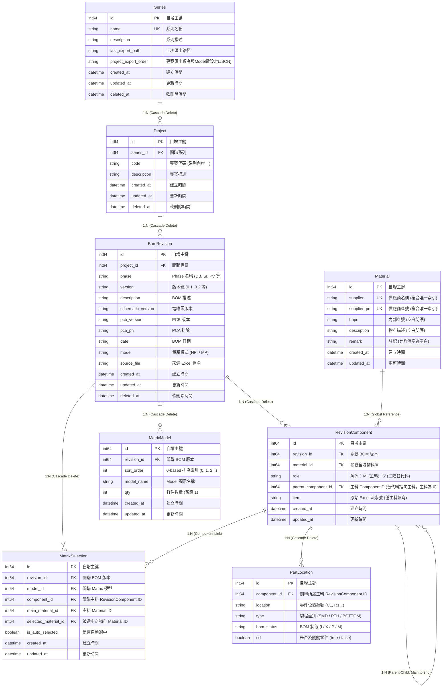

# BOMIX 資料庫規格說明書 (Database Specification)

> 本文檔為 BOMIX 專案之完整資料庫存取架構與資料模型規格書，完整記錄當前系統中 SQLite 儲存層、全域物料庫與版本關聯架構、Location 原子化設計、EBOM/BigMatrix/Matrix 匯入機制、View 延遲載入 (Late-Binding) 記憶體聚合查詢系統與相關 API 規格。

---

## 目錄

1. [核心設計原則與架構概觀](#1-核心設計原則與架構概觀)
2. [實體關聯圖 (ER Diagram)](#2-實體關聯圖-er-diagram)
3. [資料表結構定義 (Schema Details)](#3-資料表結構定義-schema-details)
4. [連線管理與並發寫入架構](#4-連線管理與並發寫入架構)
5. [Excel 匯入資料存取流程 (Import Architecture)](#5-excel-匯入資料存取流程-import-architecture)
6. [View 系統延遲載入與記憶體聚合 (Late-Binding Query)](#6-view-系統延遲載入與記憶體聚合-late-binding-query)
7. [後端資料庫層 API 規格清單 (`backend/db/`)](#7-後端資料庫層-api-規格清單-backenddb)

---

## 1. 核心設計原則與架構概觀

BOMIX 採用 **全域物料庫 (Materials)**、**版本關聯表 (RevisionComponents)** 與 **位置原子化 (PartLocations)** 的分離式關聯設計，結合 View 系統的 **延遲載入 (Late-Binding)** 與 Go 記憶體高效聚合技術，在 SQLite 本地儲存環境下達成儲存空間最省化、更新零重複與極致查詢效能。

### 1.1 核心設計原則

| 原則 | 說明 | 效益 |
|------|------|------|
| **全域物料庫純化 (Global Materials)** | 實體物料屬性（`supplier`, `supplier_pn`, `hhpn`, `description`, `remark`）獨立抽取至全域 `materials` 表，以 `(supplier, supplier_pn)` 為唯一鍵，不再於各 BOM Revision 中重複儲存零件文字資訊；徹底移除未使用的 `cost` 欄位。 | 跨版本物料完全復用，大幅節省 70% 以上資料庫儲存空間。 |
| **版本關聯輕量化 (Revision Components)** | 各 Revision 透過 `revision_components` 表僅記錄版本與物料的綁定關係。以極簡代碼 `Role='M'` 代表主料、`Role='S'` 代表二階替代料；透過 `parent_component_id` 建立主替代上下級關聯。 | 表結構輕量化，主料與替代料統一管理，單表結構簡單且高效。 |
| **Location 原子化** | 每個零件位置編號（如 `C1`、`R12`）作為獨立紀錄儲存在 `part_locations` 表中，以 `component_id` 外鍵關聯主料 Component。 | 支援對單一位置的狀態精確覆寫、CCL 判定與高效過濾。 |
| **數值鍵矩陣選取 (Numeric Matrix Selections)** | `matrix_selections` 表全面改以數值外鍵 `component_id`、`main_material_id`、`selected_material_id` 記錄，徹底廢棄舊有字串識別鍵（`group`, `material`）。 | 提升矩陣索引查詢與比對效能，徹底避免字串編碼或大小寫比對陷阱。 |
| **延遲載入 (Late-Binding)** | View 系統在載入原始資料與多 BOM 聚合階段完全不 JOIN 查詢 `materials` 表，僅以 `MaterialID` 進行分組與位置彙總；待過濾條件（如製程面別、上件狀態、CCL）篩選出最終物料群組後，在輸出前單次批次查詢 `materials` 表補齊詳細文字資訊。 | 排除不需要顯示之大量物料的查詢 I/O，顯著提升大資料量下的視圖切換與匯出效能。 |
| **EBOM 專屬 Upsert 與空白防護** | 系統中**只有在匯入 EBOM 時**會檢查並寫入/更新 `materials` 表（Matrix / BigMatrix 匯入僅作唯讀比對）。更新全域物料時具備空白防護：`hhpn` 與 `description` 在 Excel 值為空時保留 DB 既有值；`remark` 排除空白防護（新值為空時允許清空 DB 註記）。 | 保證物料屬性永遠維持最新且受防護，避免誤清空料號與描述。 |
| **Single Writer 安全並發寫入** | SQLite 啟用 WAL 模式，配合 Go Channel 佇列與 `MaxOpenConns=1` 序列化寫入。 | 保證多個非同步匯入任務並發執行時，資料庫寫入零鎖死（`database is locked`）。 |

---

## 2. 實體關聯圖 (ER Diagram)



---

## 3. 資料表結構定義 (Schema Details)

### 3.1 Series (系列元資料表)
儲存產品系列層級之總體資訊與匯出偏好。
* **Table Name**: `series`

| 欄位名稱 | 型別 (Go / SQLite) | 約束條件 | 說明 |
|---|---|---|---|
| `id` | `int64` / `INTEGER` | PRIMARY KEY | 自增主鍵 |
| `name` | `string` / `TEXT` | NOT NULL, UNIQUE (`idx_series_name`) | 系列名稱 |
| `description` | `string` / `TEXT` | | 描述說明 |
| `last_export_path` | `string` / `TEXT` | | 上次匯出目標路徑 |
| `project_export_order` | `string` / `TEXT` | | JSON 格式，儲存專案匯出排序與 Model 數量設定 |
| `created_at` | `time.Time` / `DATETIME` | | 建立時間 |
| `updated_at` | `time.Time` / `DATETIME` | | 更新時間 |
| `deleted_at` | `gorm.DeletedAt` / `DATETIME` | INDEX (`idx_series_deleted_at`) | GORM 軟刪除時間戳 |

### 3.2 Projects (專案表)
儲存系列下屬之各個獨立專案（Product Code）。
* **Table Name**: `projects`

| 欄位名稱 | 型別 (Go / SQLite) | 約束條件 | 說明 |
|---|---|---|---|
| `id` | `int64` / `INTEGER` | PRIMARY KEY | 自增主鍵 |
| `series_id` | `int64` / `INTEGER` | NOT NULL, INDEX (`idx_project_series`) | 關聯所屬 `series.id` |
| `code` | `string` / `TEXT` | NOT NULL, INDEX (`idx_project_code`) | 專案代碼（系列內唯一） |
| `description` | `string` / `TEXT` | | 專案描述說明 |
| `created_at` | `time.Time` / `DATETIME` | | 建立時間 |
| `updated_at` | `time.Time` / `DATETIME` | | 更新時間 |
| `deleted_at` | `gorm.DeletedAt` / `DATETIME` | INDEX (`idx_projects_deleted_at`) | GORM 軟刪除時間戳 |

### 3.3 BomRevisions (BOM 版本表)
儲存每一次匯入或建立的 BOM 版本元資料。
* **Table Name**: `bom_revisions`

| 欄位名稱 | 型別 (Go / SQLite) | 約束條件 | 說明 |
|---|---|---|---|
| `id` | `int64` / `INTEGER` | PRIMARY KEY | 自增主鍵 |
| `project_id` | `int64` / `INTEGER` | NOT NULL, 複合唯一索引 | 關聯所屬 `projects.id` |
| `phase` | `string` / `TEXT` | NOT NULL, 複合唯一索引 | Phase 名稱（如 DB, SI, PV 等） |
| `version` | `string` / `TEXT` | NOT NULL, 複合唯一索引 | 版本號（如 0.1, 0.2 等） |
| `description` | `string` / `TEXT` | | BOM 描述 |
| `schematic_version`| `string` / `TEXT` | | 電路圖版本 |
| `pcb_version` | `string` / `TEXT` | | PCB 版本 |
| `pca_pn` | `string` / `TEXT` | | PCA 料號 |
| `date` | `string` / `TEXT` | | BOM 日期字串 |
| `mode` | `string` / `TEXT` | DEFAULT `'NPI'` | 量產模式：`NPI` 或 `MP` |
| `source_file` | `string` / `TEXT` | | 來源 Excel 原始檔名 |
| `created_at` | `time.Time` / `DATETIME` | | 建立時間 |
| `updated_at` | `time.Time` / `DATETIME` | | 更新時間 |
| `deleted_at` | `gorm.DeletedAt` / `DATETIME` | INDEX (`idx_bom_revisions_deleted_at`) | GORM 軟刪除時間戳 |

* **複合唯一約束**: `idx_revision_project_phase_version` 涵蓋 `(project_id, phase, version)`。

### 3.4 Materials (全域物料庫)
全系統物料固有屬性的唯一儲存庫。
* **Table Name**: `materials`

| 欄位名稱 | 型別 (Go / SQLite) | 約束條件 | 說明 |
|---|---|---|---|
| `id` | `int64` / `INTEGER` | PRIMARY KEY | 自增主鍵 |
| `supplier` | `string` / `TEXT` | NOT NULL, 複合唯一索引 | 供應商名稱（廠牌） |
| `supplier_pn` | `string` / `TEXT` | NOT NULL, 複合唯一索引 | 供應商料號 |
| `hhpn` | `string` / `TEXT` | | 內部料號（具備空白覆寫防護） |
| `description` | `string` / `TEXT` | | 物料描述（具備空白覆寫防護） |
| `remark` | `string` / `TEXT` | | 註記（排除空白防護，允許更新為空字串） |
| `created_at` | `time.Time` / `DATETIME` | | 建立時間 |
| `updated_at` | `time.Time` / `DATETIME` | | 更新時間 |

* **複合唯一約束**: `idx_material_supplier_pn` 涵蓋 `(supplier, supplier_pn)`，確保全系統相同的廠牌與廠牌料號只存在單一一筆物料記錄。

### 3.5 RevisionComponents (版本零件關聯表)
記錄特定 BOM Revision 下所使用的物料以及主替代料關聯結構。
* **Table Name**: `revision_components`

| 欄位名稱 | 型別 (Go / SQLite) | 約束條件 | 說明 |
|---|---|---|---|
| `id` | `int64` / `INTEGER` | PRIMARY KEY | 自增主鍵 |
| `revision_id` | `int64` / `INTEGER` | NOT NULL, 複合唯一索引 | 關聯所屬 `bom_revisions.id` |
| `material_id` | `int64` / `INTEGER` | NOT NULL, 複合唯一索引 | 關聯全域 `materials.id` |
| `role` | `string` / `TEXT` | NOT NULL, INDEX (`idx_rev_component_role`) | 零件角色：`"M"`（主料）或 `"S"`（二階替代料） |
| `parent_component_id`| `int64` / `INTEGER`| NOT NULL, 複合唯一索引 | 所屬主料的 `revision_components.id`（主料此欄位為 0） |
| `item` | `string` / `TEXT` | | 原始 Excel 流水號（僅主料記錄） |
| `created_at` | `time.Time` / `DATETIME` | | 建立時間 |
| `updated_at` | `time.Time` / `DATETIME` | | 更新時間 |

* **複合唯一約束**: `idx_rev_mat_parent` 涵蓋 `(revision_id, material_id, parent_component_id)`，防止同一主料下重複掛載相同的替代料，或同版本重複宣告相同主料。

### 3.6 PartLocations (Location 原子化獨立表)
每個零件位置編號一筆紀錄，關聯至主料 Component，記錄該位置專屬的製程面別、上件狀態與 CCL 標記。
* **Table Name**: `part_locations`

| 欄位名稱 | 型別 (Go / SQLite) | 約束條件 | 說明 |
|---|---|---|---|
| `id` | `int64` / `INTEGER` | PRIMARY KEY | 自增主鍵 |
| `component_id` | `int64` / `INTEGER` | NOT NULL, INDEX (`idx_part_location_component`) | 關聯所屬主料 `revision_components.id` |
| `location` | `string` / `TEXT` | NOT NULL, INDEX (`idx_part_location_name`) | 零件位置編號（如 `C1`, `R105`） |
| `type` | `string` / `TEXT` | INDEX (`idx_part_location_type`) | 製程面別：`SMD`, `PTH`, `BOTTOM` |
| `bom_status` | `string` / `TEXT` | DEFAULT `'I'`, INDEX (`idx_part_location_status`) | 上件狀態：`I` (Install), `X` (NI), `P` (Proto), `M` (MP) |
| `ccl` | `bool` / `BOOLEAN`| DEFAULT `false`, INDEX (`idx_part_location_ccl`) | 關鍵零件標記：`true` (是), `false` (否) |

* **複合索引**: `idx_part_loc_status_ccl` 涵蓋 `(bom_status, ccl)`，用於視圖過濾與 NPI/MP 狀態高效檢索。

### 3.7 MatrixModels (Matrix 模型表)
儲存 Matrix 勾選矩陣中的 Model 配置資訊。
* **Table Name**: `matrix_models`

| 欄位名稱 | 型別 (Go / SQLite) | 約束條件 | 說明 |
|---|---|---|---|
| `id` | `int64` / `INTEGER` | PRIMARY KEY | 自增主鍵 |
| `revision_id` | `int64` / `INTEGER` | NOT NULL, 複合唯一索引 | 關聯所屬 `bom_revisions.id` |
| `sort_order` | `int` / `INTEGER` | NOT NULL, 複合唯一索引 | 0-based 排序索引（0, 1, 2...） |
| `model_name` | `string` / `TEXT` | | Model 顯示名稱（選填，如 A, B, C...） |
| `qty` | `int` / `INTEGER` | NOT NULL, DEFAULT `1` | 打件數量 |
| `created_at` | `time.Time` / `DATETIME` | | 建立時間 |
| `updated_at` | `time.Time` / `DATETIME` | | 更新時間 |

* **複合唯一約束**: `idx_matrix_model_revision_order` 涵蓋 `(revision_id, sort_order)`。

### 3.8 MatrixSelections (Matrix 勾選表 - 數值鍵模型)
記錄特定 Model 在特定物料群組中選中了哪一顆料。全數改用整數關聯鍵。
* **Table Name**: `matrix_selections`

| 欄位名稱 | 型別 (Go / SQLite) | 約束條件 | 說明 |
|---|---|---|---|
| `id` | `int64` / `INTEGER` | PRIMARY KEY | 自增主鍵 |
| `revision_id` | `int64` / `INTEGER` | NOT NULL, INDEX (`idx_matrix_selections_revision_id`) | 關聯所屬 `bom_revisions.id` |
| `model_id` | `int64` / `INTEGER` | NOT NULL, 複合唯一索引 | 關聯所屬 `matrix_models.id` |
| `component_id` | `int64` / `INTEGER` | NOT NULL, INDEX (`idx_matrix_selections_component_id`) | 關聯所屬主料 `revision_components.id` |
| `main_material_id` | `int64` / `INTEGER` | NOT NULL, 複合唯一索引 | 關聯主料的 `materials.id` |
| `selected_material_id`| `int64` / `INTEGER`| NOT NULL, 複合唯一索引 | 選中物料的 `materials.id` (主料或替代料) |
| `is_auto_selected` | `bool` / `BOOLEAN`| DEFAULT `false` | 是否由系統自動預設選中 |
| `created_at` | `time.Time` / `DATETIME` | | 建立時間 |
| `updated_at` | `time.Time` / `DATETIME` | | 更新時間 |

* **複合唯一約束**: `idx_matrix_sel_model_main_selected` 涵蓋 `(model_id, main_material_id, selected_material_id)`，防止同一 Model 對同一主料重複記錄相同的選中料號。

---

## 4. 連線管理與並發寫入架構

實作於 [`backend/db/connection.go`](file:///z:/Programming/BOMIX/bomix-app/backend/db/connection.go)。

### 4.1 SQLite 驅動與 Pragma 調優
BOMIX 採用純 Go 實現的 `github.com/glebarez/sqlite`，在 Windows 環境下完全不需要 CGO 編譯依賴：
1. **WAL 模式**: 執行 `PRAGMA journal_mode=WAL;`，支援讀寫並發，讀取操作不阻塞寫入，寫入操作不阻塞讀取。
2. **Synchronous 調優**: 執行 `PRAGMA synchronous=NORMAL;`，降低磁碟 I/O 等待，提升批次寫入吞吐量。
3. **外鍵級聯刪除**: 執行 `PRAGMA foreign_keys=ON;`，啟用外鍵約束，確保當刪除 Revision 時，關聯的 `revision_components`、`part_locations`、`matrix_models`、`matrix_selections` 能被 SQLite 核心自動 CASCADE 級聯清除。

### 4.2 Single Writer Pattern (單一寫入器模式)
為避免 SQLite 在多任務背景非同步匯入時出現鎖死衝突：
* `sqlDB.SetMaxOpenConns(1)` / `sqlDB.SetMaxIdleConns(1)`
* 內部維護 `writeQueue chan WriteTask`（緩衝容量 50）與背景單一 Goroutine (`StartDatabaseWriter`)，所有資料庫寫入均透過佇列循序執行，保證零 `database is locked` 異常。

---

## 5. Excel 匯入資料存取流程 (Import Architecture)

實作於 [`backend/excel/reader_ebom.go`](file:///z:/Programming/BOMIX/bomix-app/backend/excel/reader_ebom.go)、[`backend/excel/reader_matrix.go`](file:///z:/Programming/BOMIX/bomix-app/backend/excel/reader_matrix.go) 與 [`backend/excel/reader_bigmatrix.go`](file:///z:/Programming/BOMIX/bomix-app/backend/excel/reader_bigmatrix.go)。

### 5.1 EBOM 匯入流程與全域 Material Upsert

```
Excel 檔案輸入 (SMD, PTH, BOTTOM, NI, PROTO, MP, CCL)
                       │
                       ▼
┌─────────────────────────────────────────────────────────────┐
│ Phase 1: 解析與資料分流                                      │
│ 1. 讀取主製程 (SMD, PTH, BOTTOM) 與 NI:                     │
│    - 收集全域物料 (Supplier, SupplierPN, HHPN, Desc, Remark) │
│    - 收集主料 Component 及原子化 Location                     │
│    - 收集替代料關聯 (指向主料指標)                           │
└─────────────────────────────────────────────────────────────┘
                       │
                       ▼
┌─────────────────────────────────────────────────────────────┐
│ 全域 Material 批次 Upsert (帶空白防護)                       │
│ 1. 查詢既有 materials (supplier|supplier_pn)                │
│ 2. 比對差異：                                               │
│    - 新物料：INSERT 到 materials 表                         │
│    - 既有物料：                                             │
│      * HHPN / Desc 空白防護（新值非空才更新）               │
│      * Remark 排除防護（新值為空允許清空 DB 既有值）        │
│    - 記錄 log：更新/新增數量 (Info)、詳細變更內容 (Debug)    │
│ 3. 取得全數 Material.ID                                      │
└─────────────────────────────────────────────────────────────┘
                       │
                       ▼
┌─────────────────────────────────────────────────────────────┐
│ Transaction 批次寫入本 Revision 結構                         │
│ 1. 刪除該 Revision 舊資料 (CASCADE 自動清除 Locations)        │
│ 2. 批次寫入主料 RevisionComponent (Role='M', ParentID=0)      │
│ 3. 批次寫入替代料 RevisionComponent (Role='S', ParentID=MainID)│
│    * 記憶體去重：避免相同 (MaterialID, ParentID) 衝突        │
│ 4. 批次寫入 PartLocation (ComponentID 指向主料 Component.ID) │
└─────────────────────────────────────────────────────────────┘
                       │
                       ▼
┌─────────────────────────────────────────────────────────────┐
│ Phase 2: 狀態屬性覆寫與 Mode 自動判斷 (不更動 Material)      │
│ 1. 讀取 PROTO Sheet: 批次 UPDATE 匹配 Location 之 bom_status='P'│
│ 2. 讀取 MP Sheet:    批次 UPDATE 匹配 Location 之 bom_status='M'│
│ 3. 讀取 CCL Sheet:   批次 UPDATE 匹配 Location 之 ccl=true     │
│ 4. determineMode(): 比對位置交集更新 BomRevision.Mode        │
└─────────────────────────────────────────────────────────────┘
                       │
                       ▼
┌─────────────────────────────────────────────────────────────┐
│ 清理與繼承: cleanInvalidMatrixSelections + 自動繼承前一版 Selection│
└─────────────────────────────────────────────────────────────┘
```

### 5.2 Matrix 與 BigMatrix 匯入規範
* **純粹讀取比對 Material**：Matrix 與 BigMatrix 匯入時，**絕對不更新** `materials` 表的物料屬性，只依據 `(supplier, supplier_pn)` 查詢既有的 `material_id`。
* **數值鍵關聯儲存**：解析 Model 勾選標記時，寫入 `matrix_selections` 的 `component_id`、`main_material_id` 與 `selected_material_id`。

---

## 6. View 系統延遲載入與記憶體聚合 (Late-Binding Query)

實作於 [`backend/view/service.go`](file:///z:/Programming/BOMIX/bomix-app/backend/view/service.go)、[`backend/view/types.go`](file:///z:/Programming/BOMIX/bomix-app/backend/view/types.go) 與 [`backend/view/filter.go`](file:///z:/Programming/BOMIX/bomix-app/backend/view/filter.go)。

### 6.1 延遲載入 (Late-Binding) 執行時序

傳統架構在載入資料時會將所有關聯的物料文字（HHPN, Supplier, Desc, Remark 等）全部 JOIN 或查詢進記憶體；在多 BOM 聯集與視圖過濾下，大量不會被展示的物料字串佔用大量記憶體與 I/O。

新架構採取 **Late-Binding**：
```
1. loadRawData (延遲載入):
   - 僅載入 RevisionComponent (含 MaterialID、Role、ParentID)
   - 僅載入 PartLocation (含 Location、Type、BomStatus、CCL)
   - 僅載入 MatrixModel 與 MatrixSelection
   * 完全不讀取 materials 表！

2. mergeRevisions (輕量聚合):
   - 以 MaterialID 作為群組依據
   - Location 收集、去重、排序與 Qty 計算
   - 替代料關聯聚合

3. filter.Apply (視圖過濾):
   - 依據 Type, BomStatus, CCL 進行過濾 (ALL, SMD, PTH, BOTTOM, NI, PROTO, MP, CCL)
   - 篩選出最終留存的 PartGroup 清單

4. hydratePartGroups (最後一步延遲注水):
   - 收集最終 PartGroups 中所有主料與替代料的 MaterialID
   - 執行單次批次查詢：SELECT * FROM materials WHERE id IN (?)
   - 將 HHPN, Supplier, SupplierPN, Description, Remark 注水回填
   - 輸出最終視圖結果
```

### 6.2 8 種視圖過濾規則 (View Filters)

| 視圖代碼 | 視圖名稱 | 過濾條件 |
|---|---|---|
| **`ALL`** | 全部視圖 | `bom_status != 'X'`（排除不上件） |
| **`SMD`** | 正面 SMD 視圖 | `type == 'SMD'` 且 `bom_status != 'X'` |
| **`PTH`** | 通孔 PTH 視圖 | `type == 'PTH'` 且 `bom_status != 'X'` |
| **`BOTTOM`** | 背面 BOTTOM 視圖 | `type == 'BOTTOM'` 且 `bom_status != 'X'` |
| **`NI`** | 不上件視圖 | `bom_status == 'X'` |
| **`PROTO`** | Proto 狀態視圖 | `bom_status == 'P'` |
| **`MP`** | 量產 MP 狀態視圖 | `bom_status == 'M'` |
| **`CCL`** | 關鍵零件視圖 | `ccl == true` 且 `bom_status != 'X'` |

---

## 7. 後端資料庫層 API 規格清單 (`backend/db/`)

### 7.1 Series API ([`backend/db/series.go`](file:///z:/Programming/BOMIX/bomix-app/backend/db/series.go))
* `CreateSeries(db *gorm.DB, name, description string) (*Series, error)`：建立新系列
* `GetSeriesInfo(db *gorm.DB) (*Series, error)`：讀取系列元資料
* `UpdateProjectExportOrder(db *gorm.DB, orderJSON string) error`：儲存專案匯出排序與 Model 設定

### 7.2 Project API ([`backend/db/project.go`](file:///z:/Programming/BOMIX/bomix-app/backend/db/project.go))
* `GetProjects(db *gorm.DB, seriesID int64) ([]Project, error)`：查詢指定系列的所有專案
* `GetProject(db *gorm.DB, id int64) (*Project, error)`：依 ID 查詢單一專案
* `GetOrCreateProject(db *gorm.DB, seriesID int64, code, description string) (*Project, error)`：取得或建立專案

### 7.3 BomRevision API ([`backend/db/revision.go`](file:///z:/Programming/BOMIX/bomix-app/backend/db/revision.go))
* `CreateRevision(db *gorm.DB, rev *BomRevision) error`：建立 BOM 版本
* `GetRevisions(db *gorm.DB, projectID int64) ([]BomRevision, error)`：查詢專案下所有版本（依版本排序演算法排序）
* `GetRevision(db *gorm.DB, id int64) (*BomRevision, error)`：依 ID 查詢單一版本
* `FindPreviousRevision(db *gorm.DB, currentRev BomRevision) (*BomRevision, error)`：尋找同專案同 Phase 的上一版本
* `FindPreviousRevisionSmart(...) (*BomRevision, bool, error)`：智慧版本排序尋找前一版

### 7.4 Material API ([`backend/db/material.go`](file:///z:/Programming/BOMIX/bomix-app/backend/db/material.go))
* `UpsertMaterials(db *gorm.DB, materials []Material, lg MatrixLogger) (int, int, error)`：批次 Upsert 全域物料庫（含空白保護防護與日誌記錄）
* `GetMaterial(db *gorm.DB, id int64) (*Material, error)`：依 ID 查詢單一 Material
* `GetMaterialBySupplierPN(db *gorm.DB, supplier, supplierPN string) (*Material, error)`：依廠牌與廠牌料號查詢 Material
* `GetMaterialsByIDs(db *gorm.DB, ids []int64) ([]Material, error)`：批量查詢指定 IDs 的 Material 清單（供 Late-Binding 延遲注水使用）
* `GetMaterialsMapByIDs(db *gorm.DB, ids []int64) (map[int64]Material, error)`：批量查詢並轉為以 ID 為鍵的字典
* `GetMaterialMapBySupplierPNs(db *gorm.DB, keys []string) (map[string]Material, error)`：依 `supplier|supplier_pn` 列表批量查詢既有物料映射

### 7.5 Component & PartLocation API ([`backend/db/component.go`](file:///z:/Programming/BOMIX/bomix-app/backend/db/component.go))
* `CreateComponentsInBatch(db *gorm.DB, comps []RevisionComponent) error`：批次建立 RevisionComponent 記錄
* `DeleteComponentsByRevision(db *gorm.DB, revisionID int64) error`：刪除版本下所有 Component（CASCADE 自動刪除 Location）
* `GetComponentsByRevision(db *gorm.DB, revisionID int64) ([]RevisionComponent, error)`：查詢指定版本的所有 Component
* `CreatePartLocationsInBatch(db *gorm.DB, locations []PartLocation) error`：批次建立 PartLocation 記錄
* `GetPartLocationsForComponents(db *gorm.DB, compIDs []int64) ([]PartLocation, error)`：批量查詢指定 Component IDs 的所有 Location
* `DeletePartLocationsByRevision(db *gorm.DB, revisionID int64) error`：依 Revision 刪除 PartLocations

### 7.6 Matrix API ([`backend/db/matrix.go`](file:///z:/Programming/BOMIX/bomix-app/backend/db/matrix.go))
* `CreateMatrixModel(db *gorm.DB, model *MatrixModel) error`：建立 Matrix Model
* `GetMatrixModels(db *gorm.DB, revisionID int64) ([]MatrixModel, error)`：查詢版本下的所有 Model（依 SortOrder 排序）
* `UpdateMatrixModel(db *gorm.DB, model *MatrixModel) error`：更新 Model 資訊（如 Qty）
* `CreateMatrixSelections(db *gorm.DB, selections []MatrixSelection) error`：批次建立 Matrix 數值鍵選取記錄
* `DeleteMatrixSelectionsByRevision(db *gorm.DB, revisionID int64) error`：刪除版本下的所有選取記錄
* `GetMatrixSelectionsByRevision(db *gorm.DB, revisionID int64) ([]MatrixSelection, error)`：查詢版本下的所有選取記錄
* `ImportMatrixSelections(db *gorm.DB, sourceRevisionID, targetRevisionID int64, lg MatrixLogger) (*ImportMatrixStats, error)`：將來源版本的 Model 結構與 Selection 依 Material 對齊複製覆蓋至目標版本

---
*文件更新時間：2026-09-08*  
*適用版本：BOMIX v1.1.0 (全域物料庫 + 版本關聯架構)*
