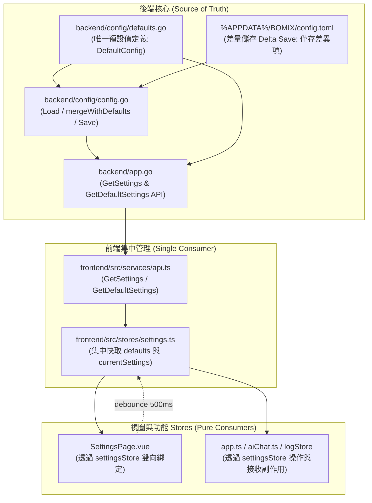

# BOMIX 系統設定單一真實來源 (SSOT) 架構規範手冊

> 本文檔為 BOMIX 專案之「應用程式設定（Configuration）系統」架構規範與標準作業程序（SOP）。
> 全體開發人員與 AI 助手在新增、修改、擴充任何系統設定項目時，必須**嚴格遵守**本文檔所規範之單一真實來源（Single Source of Truth, SSOT）架構。

---

## 1. 核心設計架構與資料流向

為徹底消除「預設值分散於前後端多處」、「前端寫死 fallback 覆蓋後端預設值」以及「設定檔反向污染」等隱患，BOMIX 確立以後端為唯一源頭的單向數據流：

---

## 2. 三大不可違背原則 (Non-negotiable Rules)

1. **唯一預設值真理來源 (The ONLY Source of Truth)**：
   全系統中所有設定項目（不論是 Theme、Logger、Import 還是 AI Assistant）的**業務預設值**，**僅能且必須定義在後端 [`backend/config/defaults.go`](file:///z:/Programming/BOMIX/bomix-app/backend/config/defaults.go) 的 `DefaultConfig` 實例中**。

2. **前端絕對零硬編碼 (Zero Hardcoding on Frontend)**：
   * **嚴禁**在 Vue 元件（如 `.vue` 檔）或 Pinia Store（如 `app.ts`, `aiChat.ts`）中寫死業務預設值。
   * **嚴禁**使用帶有硬編碼業務預設值的空值合併運算子，例如：`import?.confirmOverwrite ?? true` 或 `ai?.temperature ?? 0.1`。
   * 前端若需要預設值或表單初始化結構，**一律透過 `useSettingsStore().defaults`**（來自後端 `GetDefaultSettings()` API）動態取得。

3. **載入守衛與差量儲存防護 (Loading Guard & Delta Save)**：
   * 前端在 `settingsStore.isLoaded` 尚未確立為 `true` 之前，**嚴禁觸發任何自動儲存（Auto-save）**。
   * 後端儲存時嚴格遵循 **Delta Save（差量儲存）**——只將與 `DefaultConfig` 不同的鍵值寫入使用者硬碟的 `config.toml`。當使用者設定等於預設值時，檔案中不保存該鍵，確保後續後端調整全域預設值時能立即生效。

---

## 3. 前端架構規範 (`useSettingsStore`)

前端全面由 [`bomix-app/frontend/src/stores/settings.ts`](file:///z:/Programming/BOMIX/bomix-app/frontend/src/stores/settings.ts) 進行集中式單一入口管理：

### 3.1 核心屬性與方法
* **`defaults`**：唯讀快取自後端 `GetDefaultSettings()` 之不可變預設值結構。
* **`currentSettings`**：目前生效的使用者設定（經 `mergeWithDefaults` 自動補齊缺失欄位）。
* **`isLoaded`**：布林旗標，標記初次載入是否完成。
* **`initSettings()`**：App 啟動或頁面載入時呼叫，自動並行抓取 `defaults` 與 `currentSettings` 並分發全域副作用。
* **`saveSettings(payload)`**：持久化至後端並更新本地狀態。
* **`updateImportSettings(partial)` / `updateAISettings(partial)`**：提供給其他功能 Store 局部更新專屬設定項，自動以當前設定或 `defaults` 補齊，免除各 Store 自行拼裝物件。

---

## 4. 新增或修改設定欄位的標準作業程序 (SOP)

當未來需要新增設定項目（例如新增 `Export.AutoOpenFileAfterExport`）或調整現有預設值時，請嚴格按照以下四個步驟進行：

### 步驟 1：在後端定義結構與唯一預設值 (Backend Source)
1. 編輯 [`bomix-app/backend/config/defaults.go`](file:///z:/Programming/BOMIX/bomix-app/backend/config/defaults.go)：
   - 在相應的 Config struct（或新增 struct）加入 TOML 標籤欄位。
   - 在 `var DefaultConfig = &Config{ ... }` 中指定此欄位的**唯一預設值**。

### 步驟 2：在後端 DTO 宣告傳輸型別 (Backend DTO)
1. 編輯 [`bomix-app/backend/types_dto.go`](file:///z:/Programming/BOMIX/bomix-app/backend/types_dto.go)：
   - 在 `Settings` 或其子結構中加入 JSON 標籤欄位。
2. 編輯 [`bomix-app/backend/app.go`](file:///z:/Programming/BOMIX/bomix-app/backend/app.go)：
   - 在 `configToSettings` 函式中補充 Config 到 Settings DTO 的映射。
   - 在 `UpdateSettings` 函式中補充 DTO 到 `a.cfg` 的寫入邏輯。

### 步驟 3：在後端配置引擎支援合併與差量保存 (Backend Engine)
1. 編輯 [`bomix-app/backend/config/config.go`](file:///z:/Programming/BOMIX/bomix-app/backend/config/config.go)：
   - 在 `mergeWithDefaults` 函式中，加入 `if !md.IsDefined(...)` 補預設值邏輯。
   - 在 `Save` 函式中，加入 `if cfg.Field != DefaultConfig.Field` 的 Delta 差量判斷。
2. 撰寫或更新單元測試 [`bomix-app/backend/config/config_test.go`](file:///z:/Programming/BOMIX/bomix-app/backend/config/config_test.go)。

### 步驟 4：前端介面直接使用 (Frontend Dynamic Binding)
1. 編輯 [`bomix-app/frontend/src/services/api.ts`](file:///z:/Programming/BOMIX/bomix-app/frontend/src/services/api.ts)：
   - 在 TypeScript `interface Settings` 中補充型別定義。
2. 編輯 [`bomix-app/frontend/src/stores/settings.ts`](file:///z:/Programming/BOMIX/bomix-app/frontend/src/stores/settings.ts)：
   - 在 `mergeWithDefaults` 中補充深層合併邏輯（直接引用 `fallback.field`，不寫死任何字面值）。
3. 編輯視圖（如 [`SettingsPage.vue`](file:///z:/Programming/BOMIX/bomix-app/frontend/src/views/SettingsPage.vue)）：
   - 直接在範本中以 `v-model="settings.yourGroup.yourField"` 綁定元件。
   - **完成！前端元件無需手動配置任何預設值或 fallback，後端的預設值將自動流轉至整個前端。**
